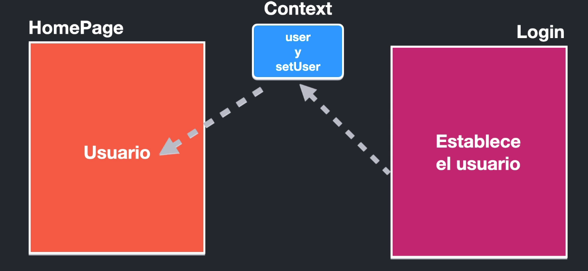

## useContext

Temas de la scción

- Context

- Provider

- useContext

- React Router

- Links y NavLinks

- CreateContext

- SPA ( Single Page Application )

El objetivo de la sección es principalmente aprender sobre el Context, el Router es un valor agregado que explotaremos mucho más en próximas secciones, pero al usar un Router, podemos explicar claramente el problema y necesidad del context.
Context centraliza la información, comunicación entre componentes sin pasar por las propidades

context - redux 

Contenedor de información en un nivel superior

 



¿Cuál es la diferencia entre context, reducer y rdux?

Una aplicación puede tener más de un <Router />.

Es muy importante utilizar exact path.

Link vs NavLink, en el segundo se puede establecer una className si coincide la ruta.

```js
import { Link, NavLink } from 'react-router-dom';

// exact activeClassName="active" si la ruta coincide
<NavLink exact activeClassName="active" className="nav-item nav-link" to="/">Home</NavLink>

```
vs 

```js
<a href="./about">about</a>
```

Utilizando un anchor tag se hace un refresh de la página

```js
// EL default de un switch
<Redirect to="/"/>
```

Componentes hermanos --> Home - About - Login

Un HOC es un componente que tiene componentes hijos


## Context

Create context 

```js
import { createContext } from 'react';

export const UserContext = createContext(null);
```

Use context
```js
import AppRouter from './AppRouter';
import { UserContext } from './UserContext';

const MainApp = () => {
  return (
    <UserContext.Provider >
      <AppRouter />
    </UserContext.Provider>
  )
}

export default MainApp
```

Share info from a HOC

```js
import React from 'react';
import AppRouter from './AppRouter';
import { UserContext } from './UserContext';

const MainApp = () => {
  
  const user = {
    id: 1234,
    name: 'Sofia',
    email: 's@gmail.com'
  }
  return (
    <UserContext.Provider value={ user }>
      <AppRouter />
    </UserContext.Provider>
  )
}

export default MainApp
```

```js
import React, { useContext } from 'react'
import { UserContext } from './UserContext';

const HomeScreen = () => {

  const userContext= useContext(UserContext)

  console.log(userContext);
  return (
    <div>
      <h1>Home Screen</h1>
    </div>
  )
}

export default HomeScreen;

``` 

Enviar múltipes valores 

```js
import React, { useState } from 'react';
import AppRouter from './AppRouter';
import { UserContext } from './UserContext';

const MainApp = () => {
  
  const [user, setUser] = useState({})

  return (
    <UserContext.Provider value={{
      user,
      setUser
    }}>
      <AppRouter />
    </UserContext.Provider>
  )
}

export default MainApp
```

```js
import React, { useContext } from 'react'
import { UserContext } from './UserContext';

const HomeScreen = () => {

  const { user }= useContext(UserContext)

  console.log(user);

  return (
    <div>
      <h1>Home Screen</h1>

      <pre>
        { JSON.stringify(user, null, 3)}
      </pre>
    </div>
  )
}

export default HomeScreen;
```
