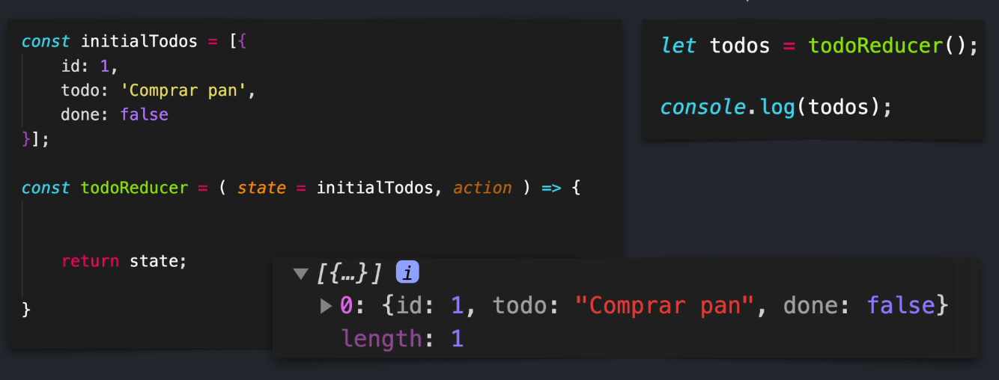
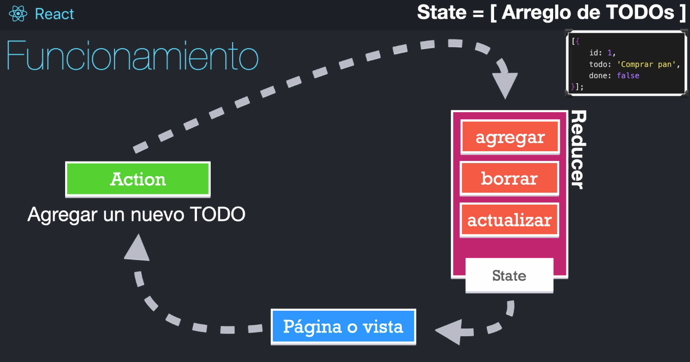

# useReducer

Temas puntuales de la sección
  
  - useReducer

  - Reducers

  - Teoría de un reducer

  - Aplicación de TODOs

  - CRUD local

  Esta es una sección dedicada a comprender el concepto de un Reducer, el cual es sumamente importante para poder entrar a **Redux** o bien usar el **contextAPI** fácilmente.

## ¿Qué es un reducer?

1. Una función que no puede ser asíncrona.
2. Debe ser una función pura: 
  - No debe tener efectos secundarios
  - No debe tener tareas asíncronas
  - Debe retornar siempre un nuevo estado
  - No debe dee llamar el localStorage o sessionStorage
  - No debe de requerir más de un acción
3. Debe retornar siempre un nuevo estado, es decir, no mutar el estado anterior.
4. Usualmente recibe dos argumentos: el valor inicial (initialState) y la acción a ejecutar

Tener en un solo lugar todas las posibles modificaciones de estado que tiene un aplicación, centralizar todos los estados

Ciclo de vida de un reducer

